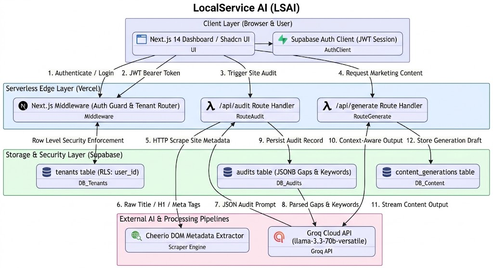

# LocalService AI (LSAI) — AI Marketing Assistant for Local Businesses

LocalService AI (LSAI) is an AI-powered marketing assistant and automated SEO auditor built specifically for home-service providers (HVAC, Plumbing, Roofing, Electrical). It automatically audits local business websites, extracts critical metadata gaps, discovers targeted local keywords, and generates high-converting marketing content—all running on a zero-operational-cost serverless stack.

## 🏛️ System Architecture Diagram

---

## ⚙️ Architecture Design Decisions & System Mapping

### 1. Interface & Execution Constraints (Latency vs. Throughput)
* **Target Latency:** Interactive UI requests target sub-300ms responsiveness. Long-running automated website scraping and 800-word blog content generation operate within asynchronous 3–10 second streaming cycles.
* **Communication Model:** Next.js Route Handlers utilizing HTTP Streaming / Server-Sent Events (SSE) for low-latency AI token rendering, alongside background database persistence.

### 2. Data Integrity & Failure Behavior (Consistency vs. Availability)
* **CAP Theorem Trade-Off:** **Strong Consistency (CP System)** for Tenant identity and Row Level Security boundaries to guarantee strict multi-tenant data isolation; **Eventual Consistency (AP)** for audit logs, keyword caches, and draft generations.
* **State Propagation:** Eventually consistent (1–3 second delay). Generated drafts and completed site audits write to Supabase Postgres before updating the client cache.

### 3. Infrastructure Economics & SLA Targets (Cost vs. Performance)
* **Operational Budget Target:** **$0 / month (100% Free-Tier Stack)**.
* **Deployment Pattern:** Single-region serverless deployment utilizing Vercel's Hobby Tier, Supabase PostgreSQL Free Tier, and Groq Cloud API.
* **Caching Strategy:** Localized in-memory caching via React `cache()` and SWR client-side fetch caching to reduce database read overhead on hot tenant data.

---

## ⚖️ Architecture Trade-Off Analysis

| Architectural Metric | Selection | Technical Justification | Intentional Trade-Off |
| :--- | :--- | :--- | :--- |
| **Compute Engine** | Next.js 14 App Router on Vercel Edge | Zero infrastructure cost and zero-maintenance serverless scaling for MVP deployment. | Bound by Vercel serverless execution timeout limits (must complete API tasks within standard route execution limits). |
| **AI Inference** | Groq Cloud API (`llama-3.3-70b-versatile`) | Extremely fast token throughput at $0 cost for structured JSON generation and copy drafting. | Dependency on third-party free-tier rate limits and availability. |
| **Persistence & Auth** | Supabase Postgres + Row Level Security (RLS) | Built-in JWT authentication combined with database-level RLS policies (`auth.uid() = user_id`) guarantees multi-tenant security natively. | Sacrifices horizontal write scaling across multiple geographic regions (unnecessary for MVP scale). |
| **SEO Audit Engine** | Serverless In-Memory DOM Parsing (`Cheerio`) | Replaces expensive third-party SEO API subscriptions by performing direct raw HTTP fetching and HTML parsing. | Cannot execute dynamic JavaScript on heavily hydrated Single Page Applications (SPAs). |

---

## 🛠️ Zero-Cost Tech Stack

* **Framework:** Next.js 14 (App Router, TypeScript) hosted on Vercel
* **Database & Security:** Supabase (PostgreSQL with Row Level Security enabled)
* **AI Orchestration:** Groq Cloud SDK (`llama-3.3-70b-versatile`)
* **Scraping Engine:** Cheerio / Node-Fetch
* **Styling & Components:** Tailwind CSS, Shadcn UI, Lucide Icons

---

